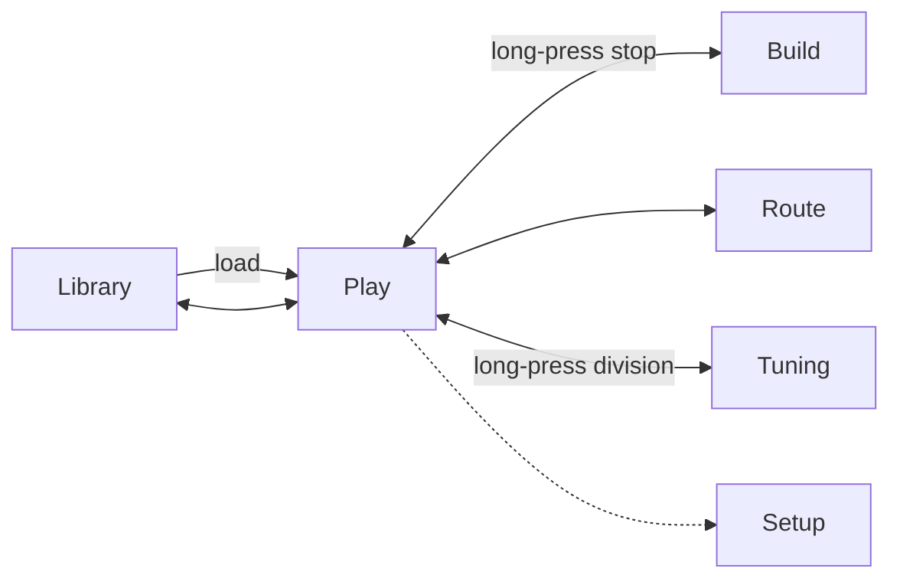

# Aristide UI and flow spec

21 Sept 2026 · @Alex

## Purpose and users

Aristide is a virtual pipe organ app that replaces GrandOrgue and Hauptwerk: it opens their organs, is friendly to a newcomer, and lets any organ be rebuilt into any kind of sound machine. The model is the Orgelpark in Amsterdam. Anything possible there is the minimum Aristide should allow.

**First user:** an organist with a MIDI console at home who has hit the ceiling of GrandOrgue. Their complaint, in order: it can't do enough, then equally that it feels dated and sounds crude. Their first session is a migration, so first run is about finding existing organs and hardware, not a tutorial.

**Two audiences, one app.** The newcomer wants to load an organ and play within two minutes without learning terminology. The experimenter wants to take the instrument apart. The design answer is that the playing surface looks conventional, and all the power sits one long-press beneath it.

**Where it's used.** Mostly at the console, hands near the keys, often on a touchscreen. Also at a desk with mouse and keyboard. Users may have any number and size of screens. The reference case for design is one medium touchscreen. Everything must work by touch and by mouse.

## Core model

**A stop is a programmable rule.** In a normal organ the rule is fixed: key N sounds pipe N of one rank. In Aristide a key press on a stop produces a set of voice events, each with a source pipe, pitch offset, time offset, level and output. A conventional stop is the one-voice case.

Every advanced feature is this one idea:

| Feature | How the rule expresses it |
|---|---|
| Composite stop (Guillou's théorbe) | Several voices at chosen intervals |
| Delay stop | Several voices at chosen time offsets |
| Melody or sampler stop | Voices with both pitch and time offsets |
| Borrowing across sample sets | A voice's source can be a rank from any loaded organ |
| Speaker routing | Each voice, rank or division has an output |
| Retuning, modulation | Any number on a stop can be overridden or driven by a control |

**Layers.** Aristide never modifies an imported organ. All customisation is saved as a layer on top. An instrument is one or more organs plus a layer. Imports stay exact, everything is revertible, and an instrument file can be shared without containing anyone's samples.

**Stops are cheap.** Duplicating a stop shares its samples and costs no memory. A variation of a sound is a new stop, not a new setting somewhere else. This is what keeps combinations simple (see Combinations).

**Stable names.** Every parameter has a stable address in the data model so that MIDI, OSC and later scripting can reach it.

## Control flow rules

These seven rules apply on every screen and outrank any individual screen's design.

1. **Play is home.** The app opens on Play. Every other screen is one tap from it and one tap back.
2. **Two modes: perform and edit.** A padlock in the top bar switches between them. In perform mode nothing can be moved, added or changed, and long-press does nothing, so a stray touch mid-piece is harmless. In edit mode everything is editable. Setting pistons works in both.
3. **You enter Build through a stop.** In edit mode, long-press a stop to open its editor. At the console you open the thing you're pointing at and never navigate to it.
4. **Sound never stops.** No screen change, sheet or edit interrupts audio. Only loading a different organ does.
5. **Sheets, not dialogs, for editing.** Editors and pickers slide in while the keys keep working. Modals are reserved for errors, destructive actions and decisions that block progress.
6. **No save button.** The layer autosaves, undo is global and deep, and snapshots mark a version on purpose.
7. **Every number behaves the same.** Drag to change, tap for a stepper, type if there's a keyboard, long-press to assign a control.

Play sits at the centre and every other panel returns to it.

## Screens and shell

The whole app is five panels, one settings screen, a one-time first run, and three sheets.

| Screen | Purpose | How often seen |
|---|---|---|
| Play | The console. Home. | Always |
| Build | Edit one stop's rule | Often |
| Route | Sources to speakers | Occasionally |
| Tuning | Pitch, temperament and tuning system at every level | Occasionally |
| Library | Pick or import an organ or instrument | Start of session |
| Setup | MIDI console, audio device, screen assignment | Once, then rarely |
| First run | Find organs, learn console, test sound | Once |

Sheets that slide over any panel: source picker (choose a rank from any loaded organ), assign control (MIDI-learn or LFO for any number), snapshots (saved versions of the instrument).

A new feature should become a row, column or sheet in an existing panel before it becomes a new screen.

**Top bar, identical everywhere, left to right:** instrument name, panel tabs (Play, Build, Route, Tuning, Library), perform/edit padlock, undo, CPU and memory readout, Panic, Setup.

**Panels and screens.** Each panel can be sent to any screen. One small screen shows panels as tabs. Two jamb screens take a panel each. A large monitor shows several side by side, for example Play with Build open beside it. On a small screen a sheet goes full-screen with a back arrow.

## First run and everyday flow

Target: sound within two minutes of first launch, with no settings dialog seen.

### First run

1. **Find my organs.** Aristide scans the usual GrandOrgue and Hauptwerk folders, or the user points at one. A small bundled organ guarantees sound with nothing installed.
2. **Learn the console.** "Press a key on each manual, bottom to top, then a pedal." No channel numbers typed. Skippable.
3. **Test sound.** The audio device is chosen automatically and a test note plays. Change it only if it's wrong.
4. **Pick an organ.** The Library shows what was found. Tap one, it loads, and the user lands in Play in perform mode.

Every day after: open the app and the Library appears. Nothing loads until an organ is chosen (Alex, 22 Sept 2026; this replaces restoring the last instrument).

## Play

Play is an abstract console: stops as large toggles grouped in one column per division, couplers beside them, pistons along the bottom.

- A stop is a rectangle with its name large and its pitch small. On is filled, off is outlined. Minimum target about 60 px, with a comfortable/compact density switch.
- Layout comes from the organ definition, so an imported organ looks right with no effort. In edit mode stops can be dragged, and the arrangement is stored in the layer.
- Custom stops look like any other stop with a small mark. Whether a stop is a plain Bourdon or a twelve-voice delay machine is invisible until it's opened.
- Division headings show a small tag when that division's tuning differs from the instrument, for example "meantone, 415".

**Edit-mode actions on a stop** (long-press or right-click): Edit (opens Build), Duplicate (copies the stop and opens Build on the copy), Rename, Hide from console, Delete.

**Variants.** Duplicates accumulate, so a stop can be hidden from the console while still usable in pistons. In edit mode, variants of the same stop are shown grouped together.

**Also on Play:** MIDI record and playback, as a small transport. It lets players hear themselves from the nave and is the seed of the later DAW ambition.

## Combinations

A combination stores which stops are on and nothing else. It works exactly as on a real organ.

- A row of numbered generals, Set, Cancel, and large Prev / Next for the stepper.
- To store: press Set, then a piston. To recall: press the piston.
- Divisionals sit under each division's column and can be absent.
- Combinations live in named sets ("Franck Choral 3", "Sunday"), chosen from a dropdown beside the pistons and saved separately from the instrument. One instrument serves many pieces.
- A Sequence sheet shows the stepper as an ordered list that can be reordered, inserted into and labelled.
- Pistons, Prev and Next can be MIDI-learnt to physical pistons and toe studs in edit mode.

**Why on/off only.** Delay, routing, tuning and every other parameter belong to the stop. To have the Théorbe at 120 ms to the front and at 300 ms to the rear, make two stops and let pistons choose between them. This gives scene-like changes using a concept every organist already knows.

Changes wider than a stop, such as retuning a whole manual mid-piece, go through assign control (a MIDI button or toe stud), not pistons. Pistons handle registration. Controls handle everything else.

## Build

Build edits one stop, shown as a list of voice rows. It is the only new interface idea in the app and deserves the most design iteration.

**Header:** stop name, the division it belongs to, a per-stop load figure (a twelve-voice stop uses twelve times the polyphony), and a tuning choice (follow division, or override).

Each voice row has:

| Field | Meaning |
|---|---|
| Source | A rank from any loaded organ, chosen in the source picker |
| Pitch | Offset in semitones or cents |
| Delay | Time offset in ms |
| Level | Gain for this voice |
| Output | Follow the stop's output, or a specific speaker group |
| Key range | Which keys this voice responds to |
| Tuning | Follow this stop's tuning (default) or keep the source's own |

### Selected direction: piano roll (22 Sept 2026 · Alex)

Alex selected the piano-roll study. Build now proceeds through four clickable
mutations of that direction before connecting the editor. Alex subsequently
selected **Split desk**. The row/table language
above describes the available event fields; it does not prescribe the chosen layout.

- Pitch runs vertically in cents, with **0 cents initially centred**. Time runs
  horizontally. Both axes zoom and pan, with touch and mouse controls, following
  professional DAW piano-roll behaviour.
- There are two relative timelines: **Key down + ms** and **Key up + ms**. Each
  begins with a fixed 0 ms timestamp. Additional shared timestamps are added with
  a button and editable time. Every onset and finite ending references a timestamp;
  moving it moves all attached events. Endings on the same timeline follow starts.
- A new key-down event defaults to **until release**. Its bar points right at the
  edge of the visible roll. A finite event spans its start and ending timestamps.
  An early key-up stops ordinary key-down events and cancels their pending starts.
- **Hold after release** has a right arrow on the key-down roll and a matching left
  arrow on the key-up roll, extending to its finite ending timestamp. A continued
  event must have started before key-up; it is not retriggered by release.
- New events can start after key-up and retain the released key's pitch. All
  release-triggered events and held continuations require a finite ending. These
  programmed events are separate from the sample's ordinary recorded release tail.
- Lines represent the global tuning system, without constraining pitch unless
  **Snap pitch** is enabled. Continuous cents are the default. A regular time grid
  is optional and off by default; timestamp constraints always apply.
- An event can target a rank or a **live reference to another stop in the same
  organ**, executing its complete rule regardless of its console on/off state.
  References compose pitch and timing, reflect later source edits, and must reject
  self-reference and indirect cycles. Rank borrowing across organs remains available.
- The comparison fixture is **Titanique**: Théorbe at 0 ms / 0 cents, Flute 4′ at
  0 ms / +1,250 cents ending at 50 ms, and Ophicleide 32′ at 50 ms / −2 cents.

### Behaviour

- A normal stop is one row. Every new stop starts as a duplicate of an existing one, so there's always sound to modify.
- Add voice appends a row. Théorbe: rows at intervals. Delay stop: rows with delays. Melody stop: rows with both.
- Play a key at any time to hear the current state. There is no apply button.
- Per-key editing: hold a key and edits apply to that key only, including per-pipe level and detuning. Release to return to the whole stop. Keys with overrides are marked on a small keyboard strip.
- Assign control: long-press any number to MIDI-learn a pedal, knob or button, or to attach an LFO. One mechanism for swell-on-LFO, live retuning and everything similar.

**Console and desk.** At the console, rows are large and edited by touch. At a desk, the same data appears as a dense table with typing and multi-select, and the Build tab lists all stops down the left. Same model, two densities.

Build only opens in edit mode.

## Route

Route is a matrix: sound sources down the side, speaker outputs across the top, tap a cell to connect.

- Outputs are named speaker groups defined in Setup ("Front L+R", "Rear", "Sub").
- Sources start at division level. Expand a division to its ranks, and a rank to its pipes, only when needed.
- Inheritance applies: a rank follows its division and a pipe follows its rank unless overridden. Overrides are marked.
- Pipe-level patterns are offered as presets, for example C and C♯ sides to alternating speakers, so nobody taps 61 cells by hand.
- A cell can hold a level, not only on or off, using the standard number behaviour.
- A stop's or voice's Output field in Build is the same data seen from the other side.

A normal user never opens Route. Everything goes to the main output by default.

## Tuning

Tuning is set by inheritance across four levels: instrument, division, stop, pipe. Each level follows the one above unless overridden.

**The one rule:** tuning belongs to the pipes, not the keys. If the Récit in meantone is coupled to the Grand-orgue in equal temperament, the Récit pipes still sound in meantone, as they would on a physical organ.

### What each level can set

| Setting | Options |
|---|---|
| Reference pitch | A chosen key anchored to any frequency in Hz; A = 440, 415, 392 or 466 are conventional examples |
| Temperament | Equal, as recorded (the sample set's own tuning), historical presets (quarter-comma meantone, Werckmeister, Vallotti, Kirnberger and others), custom |
| Root note | The key the temperament is centred on |
| Tuning system | Any number of equal or unequal pitch steps, conventional twelve-note temperaments, just intonation, imported Scala file |
| Repetition | Optional: 2:1, another ratio or interval, or no repetition at all |
| Key mapping | How a non-twelve scale lands on the keyboard |
| Fine offset | Cents |

### Panel layout

- Left: scope list. "Whole instrument" at the top, then each division, each expandable to its stops. Any scope with an override shows a mark.
- Right: one card for the selected scope. At the top, a toggle: Follow [level above]. When on, inherited values are shown greyed, so what's in effect and where it comes from is always visible. When off, the fields are editable.
- Below the fields: the twelve notes as bars showing each note's deviation in cents. Choosing Custom makes the bars draggable. Playing a key lights its bar. For non-twelve systems the picture shows the scale's steps with the key mapping beneath.

What a normal user sees: "Whole instrument" is already selected, and the card shows pitch and temperament. Two controls.

### Selected direction: scope and card (22 Sept 2026 · Alex)

Alex selected the scope list and tuning card, and requested another iteration
focused on arranging the controls more like a DAW. Keep the scope browser and
one selected-scope card. Compare four clickable arrangements: a channel strip,
a device rack, an editor with a docked inspector, and a tabbed device. Keep
reference pitch, scale settings, fine offset and selected-note editing grouped
consistently within each arrangement. These remain silent design studies until
connected; they must not imply working MIDI, persistence or sound.

Alex broadly preferred **Channel strip**, the first arrangement. He clarified
that neither twelve tones nor octave equivalence may be assumed. A scale's step
count, its optional repeat interval, and its key mapping are separate facts.
2:1 repetition is one choice, not a universal container. Non-repeating pitch
collections must not wrap or extrapolate at their boundaries. Use neutral step
and key identifiers outside conventional note systems, and show intervals from
the reference instead of deviations from twelve-tone equal temperament. Cents
remain a logarithmic interval unit; using them does not imply octave equivalence.
The selected arrangement must handle these cases without moving the main controls.

### Connections

- In Play, long-press a division heading and choose Tuning to open that scope directly.
- A division that differs from the instrument shows a tag under its heading in Play.
- In Build, the stop header holds the stop-level override, each voice row chooses follow-stop or keep-source, and per-pipe detuning is the hold-a-key mode.
- Every tuning value is an ordinary number, so it can be assigned to a control. Retuning a manual to 31 equal from a toe stud needs no extra design.

## Library and loading

The Library lists organs (imported, untouched) and instruments (organs plus a layer) as large cards with name, builder or location, size in memory, and last played.

- Tap a card to load it. Add organs rescans or points at a folder.
- New instrument from this organ creates an empty layer on top. Editing an organ for the first time does this automatically, so the user never has to understand layers to start.
- Snapshots of an instrument are listed on its card.

**While loading:** a progress bar with the organ's name, a rank count and a cancel button. Nothing else.

When it doesn't fit in memory, Aristide knows before starting and never fails halfway. One modal: "This organ needs 38 GB. You have 24 GB available." Three choices:

1. **Load a lighter version (recommended).** Trims in the least audible order: fewer release samples, then lower bit depth, then shorter loops, stopping as soon as it fits. Reports what it did in one line.
2. **Choose what to load.** A list of ranks with sizes and toggles, and a bar showing the running total against available memory.
3. **Cancel.**

The choice is remembered per organ.

**Borrowed ranks.** In the source picker each rank of another organ shows its size ("+1.2 GB") and loads on its own with a small progress bar in its row. Borrowing one stop never requires loading a whole second organ.

## Setup and errors

Setup holds what is configured once: the MIDI console, audio, speakers and screens. It is reached from the gear in the top bar and is never required after first run.

- Console: re-run "press a key on each manual", and MIDI-learn pistons, swell pedals and toe studs.
- Audio: device, buffer size, sample rate, with a plain-language latency readout.
- Speakers: name the output groups that appear as columns in Route.
- Screens: a picture of the connected screens. Drag panels onto them.
- Appearance: dark or light, comfortable or compact.

**Errors are modals.** Anything that needs a decision or stops the sound gets a popup: a device unplugged, missing sample files, a borrowed organ that has moved, an organ that can't be opened. One sentence on what happened, one on what to do, one or two buttons. Never a raw error string.

**The perform-mode exception.** In perform mode, a problem that fixes itself, such as a momentary audio glitch, does not raise a modal, because a popup over the pistons mid-piece is worse than the glitch. These are logged and shown when the user switches to edit mode. Anything that actually stops the sound still raises a modal immediately.

## Visual rules

These rules are applied without exceptions, so that the look needs no taste to maintain.

- Dark by default. Consoles sit in dim rooms beside a music desk. Light is an option.
- Flat and abstract. No wood, ivory or drawknob photographs. Users build custom organs, so the console must not imitate any one instrument.
- Three colours with jobs. One accent for on or active, one for custom or modified, red only for Panic and destructive actions. Everything else is grey. Divisions are told apart by position and heading, not colour.
- One typeface, two weights, three sizes. Stop name large, pitch small, everything else medium.
- Targets of about 60 px on Play in comfortable density.
- Marks, not decoration. The custom-stop mark, the override mark and the tuning tag are the only ornaments, and each means exactly one thing everywhere.
- Use a stock component library with its defaults for everything that isn't the console itself.

Interaction references (borrow behaviour, not looks): Ableton Live for a flat, dense, two-view music tool. RME TotalMix and Dante Controller for routing matrices. Elektron-style step sequencers for editing rows of pitch and time by touch.

## Later, and how to use this spec

Not in version one, though the model leaves room for each:

- A node-graph view of stop rules for desk use
- A DAW-style timeline, growing out of MIDI record and playback
- OSC and scripting control, using the stable parameter names
- Sharing and browsing other people's instruments

### Using this with an AI

1. Give it this whole doc as context every session, so conventions don't drift.
2. Play, Route, Library and Setup follow strong conventions. Ask for one implementation of each.
3. Build and Tuning are new. For each, ask for four structurally different clickable mocks (for Build: row list, step-sequencer grid, piano-roll, per-key keyboard view), pick by feel, then ask for four mutations of the winner. Repeat until it stops improving.
4. Have a fresh session role-play a first-time organist walking through first run and narrating every hesitation. Treat each hesitation as a bug.
5. Have it screenshot the running UI and check it against Control flow rules and Visual rules.
